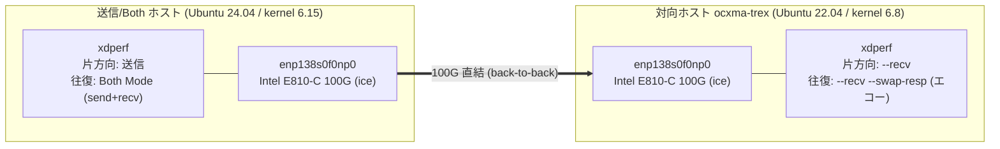
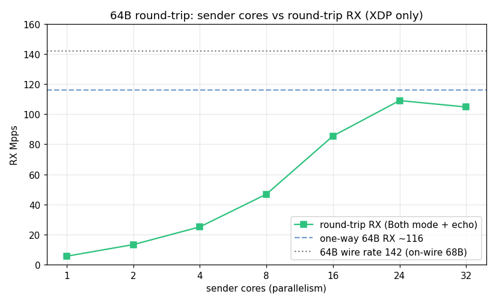
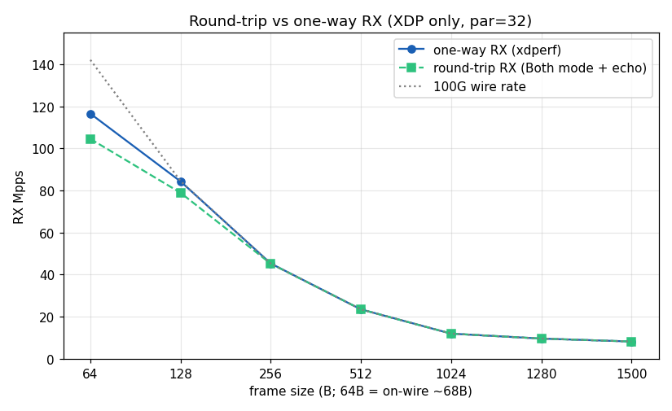

# 実機100Gベンチマーク：XDPの片方向・往復スループット

XDPerf を実機の 100G NIC で計測した。
送信も受信も xdperf（XDP）で行い、DPDK は使わない。
片方向スループットに加えて、Both Mode（`--send --recv`）と対向のエコー（`--swap-resp`）を組み合わせた往復スループットを測る。

## 構成



往復では、Both ホストが送信し、対向がエコーで打ち返し、戻りを Both ホストの RX（`recv/s`）で数える。
計測値は常に受信側カウンタである（片方向は対向の `recv/s`、往復は Both ホストの `recv/s`）。

## 計測環境

| 項目 | 送信/Both ホスト | 対向ホスト（ocxma-trex） |
|------|-----------------|------------------------|
| 役割 | xdperf 送信 / Both Mode | xdperf 受信 / エコー |
| OS | Ubuntu 24.04.3 LTS | Ubuntu 22.04.5 LTS |
| kernel | 6.15.0-rc6-btf-fixed+ | 6.8.0-124-generic（HWE） |
| CPU | Intel Xeon Platinum 8362 @ 2.80GHz | 同一（Xeon Platinum 8362） |
| コア構成 | 32コア / 64スレッド / 1ソケット / 1 NUMA | 同左 |
| メモリ | 62 GiB | 62 GiB |
| NIC | Intel E810-C 100GbE（ice, fw 4.00 / 21.5.9） | 同一 |
| データNIC | enp138s0f0np0（PCI 8a:00.0） | enp138s0f0np0（PCI 8a:00.0） |
| リンク | 100G 直結（ケーブル back-to-back、スイッチなし） | |

計測設定は次のとおりである。

- 送信：XDP_LIVE_FRAME、`--batch-size 64`、`--count 128`（パケットプール）。
- multiflow：UDP 送信元ポート 1024–1124 を順次掃引する（約100フロー）。
- 送信側チューニング：`mitigations=off iommu=pt`、TXリング 256、MTU 1500。送信前に `probe` を挟まない。
- フレーム長の定義：128B 以上は on-wire（FCS込）が表記値になるよう payload を表記−46 とする。64B は xdperf 最小フレームで payload 22、on-wire は約68B である。
- Gbps は「実測 pps × L2フレーム長（FCS除く） × 8」で算出する（FCS除く L2 長は 64, 124, 252, 508, 1020, 1276, 1496 B）。
- 送信コア数は物理コア数の 32 を上限とする。SMT 領域（33コア以上）では送信スレッドと受信割り込みが同じコアで競合し、スループットが落ちるためである。

## 実験1：往復スループット 送信コア数スイープ（64B）

64B 固定で送信コア数（parallelism）を 1 から増やす。
対向はエコー、Both ホストが送信しつつ戻りを RX で数える。

| 送信コア | 往復RX Mpps | Gbps(L2) | 64Bワイヤーレート比(142) |
|--------:|-----------:|---------:|:---------------:|
| 1       | 5.56       | 2.8      | 4%   |
| 2       | 13.26      | 6.8      | 9%   |
| 4       | 25.07      | 12.8     | 18%  |
| 8       | 46.82      | 24.0     | 33%  |
| 16      | 85.54      | 43.8     | 60%  |
| 24      | **109.09** | 55.9     | 77%  |
| 32      | 104.81     | 53.7     | 74%  |



往復RX は 24コアでピーク（109 Mpps）に達する。
送信コア数は物理コア数の 32 を上限として測定する。
物理コアを超えてスレッドを増やすと、送信スレッドと戻りの受信割り込み（NAPI/softirq）が同じコアで競合し、かえって低下するためである。
32コアが 24コアよりわずかに低いのも、この競合がすでに始まっているからである。
往復が片方向の 64B（実験2の 116.5 Mpps）より低いのは、Both ホストが送信と受信を、対向がエコーの受信と送信を、それぞれ1ポートで兼ねるためである。
64B でのスイートスポットは 16〜24 コアである。

## 実験2：スループット ペイロード長スイープ（片方向 vs 往復）

送信 par=32、multiflow。
片方向は対向の `--recv`、往復は Both Mode で測る。

| frame(B) | 片方向RX Mpps | 往復RX Mpps | 100Gワイヤーレート Mpps | 往復Gbps(L2) |
|---------:|------------:|-----------:|-------------:|------------:|
| 64       | 116.5       | 104.5      | 142.0        | 53.5        |
| 128      | 84.3        | 78.9       | 84.5         | 78.3        |
| 256      | 45.3        | 45.2       | 45.3         | 91.1        |
| 512      | 23.5        | 23.5       | 23.5         | 95.5        |
| 1024     | 11.97       | 11.97      | 11.97        | 97.7        |
| 1280     | 9.62        | 9.62       | 9.62         | 98.2        |
| 1500     | 8.22        | 8.22       | 8.22         | 98.4        |



256B 以上は片方向も往復も 100G ワイヤーレートに達する。
リンクは全二重なので、戻りは行きとは逆方向の 100G を使い、各方向がワイヤーレートで回るためである。
64B と 128B だけは往復が片方向よりやや低い（エコー側 NIC が 1 ポートで RX と TX を兼ねるため）。
64B のワイヤーレート 142 は on-wire 68B を基準にした値である。

## 結論

- 送信も受信も xdperf（XDP）だけで、片方向・往復とも 100G を回せる（DPDK は使わない）。
- 256B 以上は片方向も往復もワイヤーレート（100G）に達する。
- 64B は片方向で約116 Mpps、往復で約109 Mpps（24コア）。往復が下がるのはエコー側 NIC の RX+TX 兼務による。
- 往復 64B のスループットは24コアでピークになる。物理コア数（32）を超えると送信スレッドと受信割り込みが競合して下がるため、送信コア数は32を上限とする。

## 再現時の注意点

- 往復では送信の宛先 MAC を**対向のユニキャスト MAC** にする（`--cfg` の `dst_mac`）。ブロードキャスト宛だと、エコーの MAC スワップで送信元 MAC がブロードキャストになり、戻りが受信側 NIC で落ちて RX=0 になる。
- 受信側 xdperf は kernel 5.18 以上が必須である（`bpf_xdp_load_bytes` = BPF helper #190。5.15 では `invalid func unknown#190` でロードできない）。
- ice と XDP の実用フレーム域は on-wire 1500B 以下である。フレーム 1500B に FCS 4B が付いた on-wire 1504B は受信 XDP バッファで NIC ドロップし、MTU を上げると送信 XDP-TX がアタッチできない。
- 送信前に `xdperf probe` を挟まない（dummy XDP の付け外しで XDP-TX が空回りし、NIC 送出が 0 になることがある）。
- xdperf の最小フレームは 64B である（payload が 22 未満だと `base packet too small` で拒否される）。
- 64B の Gbps は小さく見えるので pps で評価する。

## 再現コマンド

片方向。送信（Both ホスト）と受信（対向）。

```bash
# 送信（例は 64B・32コア。payload: 64B=22,128B=82,256B=210,512B=466,1024B=978,1280B=1234,1500B=1454 = frame-46）
sudo ./out/bin/xdperf run --device enp138s0f0np0 \
  --plugin simpleudp.go --plugin-path ./out/bin \
  --count 128 --parallelism 32 --infinite --batch-size 64 \
  --cfg '{"src_ip":"192.168.1.1","dst_ip":"192.168.1.2","dst_port":10001,"payload_size":22,"is_arp_resolve":false}'

# 受信（対向）。recv/s が片方向の受信PPS
sudo ./out/bin/xdperf run --device enp138s0f0np0 --send=false --recv
```

往復（Both Mode）。対向をエコー、Both ホストが送信しつつ戻りを RX で数える。

```bash
# 対向: エコー（受信してMAC/IPスワップで打ち返す）
sudo ./out/bin/xdperf run --device enp138s0f0np0 --send=false --recv --swap-resp

# Both ホスト: 送信 + 受信。dst_mac は対向のユニキャストMAC。recv/s が往復スループット
sudo ./out/bin/xdperf run --device enp138s0f0np0 \
  --plugin simpleudp.go --plugin-path ./out/bin \
  --count 128 --parallelism 24 --infinite --batch-size 64 --recv \
  --cfg '{"src_ip":"192.168.1.1","dst_ip":"192.168.1.2","dst_port":10001,"payload_size":22,"dst_mac":"40:a6:b7:82:cd:d8","is_arp_resolve":false}'
```

## グラフの再生成

本ドキュメントの図は、計測値を内蔵した `docs/ja/scripts/plot_benchmark.py` で生成する（要 matplotlib, numpy）。

```bash
python3 docs/ja/scripts/plot_benchmark.py   # docs/ja/imgs/ に PNG を出力
```

## 追試: kernel 7.2 での再測定（2026-07）

同一ハードウェア（送信側のみ kernel 7.2.0-rc2 へ更新、対向は 6.8 のまま）で主要な点を再測定した。
kernel 7.2 以降では BPF stack-arguments 対応の影響で修正（#104）を含むビルドが必要である。
測定方法は本ドキュメントと同一（受信側カウンタ、各3回の中央値、`--batch-size 64`、プール128、multiflow）。

### ベースライン再現性

| 項目 | 6.15 実測 | 7.2 実測 | 差 |
|---|---:|---:|---|
| 64B 片方向 par=32 | 116.5 | 115.8 | -0.6% |
| 64B 往復 par=24 | 109.1 | 110.9 | +1.7% |

カーネル更新をまたいでも ±2% 以内で再現する。
なお 6.15 で観測された par=32 往復の低下（109.1→104.8）は 7.2 では再現しない（par=24: 111.0 / par=32: 110.7）。
mpstat では par=32 時に送信スレッドと受信 softirq が全物理コアで同居する構図自体は変わらないが、
性能影響はカーネル版に依存する。

### IOMMU の効果（iommu=pt の before/after）

| ブートパラメータ | 64B 片方向 par=32 |
|---|---:|
| `intel_iommu=on`（DMA 変換あり） | 42.3 Mpps |
| `iommu=pt`（passthrough） | **115.8 Mpps（2.74倍）** |

7.2 では IOMMU 有効時のロック競合（6.15 時代に perf で観測された `native_queued_spin_lock_slowpath` 集中）は
解消されており、コストは IOVA 変換・DMA マッピング処理（`__iova_to_phys` / `__map_single_page` 等で合計 ~25%）に
分散している。いずれにせよ `iommu=pt` の効果は大きい。

### フロー数スケーリング

simpleudp の `src_port_sweep_start` / `src_port_sweep_end` でフロー数（= src port 掃引幅）を変えて測定した
（`--count` はフロー数に一致させる）。

| フロー数 | 64B 片方向 par=32 |
|---:|---:|
| 100 | 115.84 |
| 1,000 | 115.11 |
| 10,000 | 115.15 |
| 64,512（port 空間上限） | 115.09 |

100 → 64,512 フローで低下は 1% 未満である。cache-miss は増える（+62%）が、
per-CPU の diff エントリ（~2016個 × 166B ≈ 335KB）が概ね L2 に収まるため吸収される。
単一の 2byte port フィールドで表現できるのは最大 64,512 フローで、それ以上は複数フィールドの掃引が必要になる。

### チェックサムキャッシュの効果

初回だけチェックサムを計算して diff にキャッシュする最適化（csum_cached）の有無を比較した。

| 条件 | par=1 | par=32 |
|---|---:|---:|
| キャッシュ有効 | **6.04 Mpps** | 115.8 |
| キャッシュ無効（毎回再計算） | 4.10 Mpps | 115.8 |

コアあたりスループットで **+47%**。par=32 で差が出ないのはリンク側が律速のためで、
このキャッシュは「少ないコア数で 100G を回す」ための最適化である。

### veth（コンテナ相当環境）

netns ペア + veth でも測定した。veth はデフォルト 1 キューで受信処理が直列化されるため 64B 7.4 Mpps で頭打ちになるが、
multi-queue veth（8キュー）では 64B 61.3 Mpps / 1500B 36.7 Mpps までキュー数にほぼ線形にスケールする。
詳細と作成方法は [tips.md](tips.md) の「veth は multi-queue にできる」を参照。
