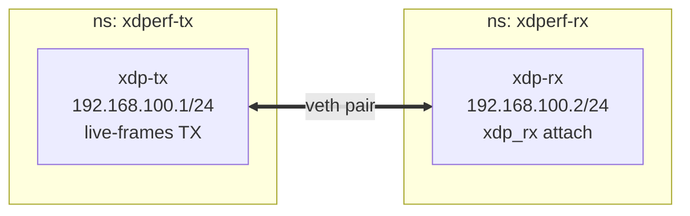

# examples — veth-based local end-to-end tests

Self-contained example scenarios that connect two network namespaces with a
veth pair, send with xdperf on one side and receive on the other, and verify
the result with **real counters**. No physical NIC or VM required — runs on a
single Linux host (including CI ubuntu runners).

For verification closer to a real NIC path with QEMU 2-VM, see
[scripts/vmlab](../scripts/vmlab/README.md).

## Prerequisites

- Linux kernel 5.18+ (XDP live-frames required; automatically SKIPs on
  unsupported kernels)
- root privileges (for netns / veth / eBPF operations)
- `iproute2`, `ethtool`
- `make build` done at the repository root (`out/bin/xdperf` and `*.wasm`)
- [otlp-metrics](otlp-metrics/) only: `docker` and `curl` (SKIPs when docker is
  unavailable)

## Usage

```bash
make build

# Run all scenarios at once
sudo ./examples/run_all.sh
# or
make examples

# Run a single scenario
cd examples/simpleudp
sudo ./setup.sh && sudo ./test.sh && sudo ./teardown.sh
```

## Scenarios

| Scenario | Description |
|----------|-------------|
| [simpleudp](simpleudp/) | Basic UDP send/receive. Verifies rx counter == packets sent |
| [simpleudp-vlan](simpleudp-vlan/) | UDP with an outer 802.1Q tag. Verifies counting through VLAN parsing |
| [simpleudp-echo](simpleudp-echo/) | Echo server (`--swap-resp`) round-trip. Verifies the `XDP_TX` return path over veth |
| [simpleudp-no-rx-attach](simpleudp-no-rx-attach/) | Negative case: without peer XDP attach (and GRO off) packets are silently dropped; with GRO on they arrive |
| [simpleudp-xdp-generic](simpleudp-xdp-generic/) | Forced generic (SKB) mode via `--xdp-mode generic` on both sides. Verifies the attach mode and end-to-end delivery |
| [simpleudp-split-rx](simpleudp-split-rx/) | One process with `--rx-device`: TX on one veth, forwarded by a middle "DUT" netns, counted by `xdp_rx` on a second veth |
| [srv6](srv6/) | SRv6 (RFC 8754) traffic via the srv6.go plugin, all three encapsulation modes (`l3vpn_ipv4`/`l2vpn_eth`/`ipv6`). Verifies rx counter == packets sent per mode |
| [otlp-metrics](otlp-metrics/) | OTLP metrics push (`--otlp-endpoint`) to an OTel Collector in docker. Verifies the exported counters via the prometheus exporter. SKIPs without docker |

## How it works



- The sender does not attach XDP to the device; it transmits from the veth via
  `BPF_PROG_RUN` live-frames
- The receiver attaches the `xdp_rx` program, which counts IPv4/IPv6 frames and
  DROPs them
- The veth XDP TX path requires the peer's NAPI to be active (an XDP program
  attached on the peer, or GRO enabled — the latter since kernel v5.13,
  `d3256efd8e8b` "veth: allow enabling NAPI even without XDP") — otherwise
  frames are silently dropped
  ([XDP ate my packets](https://fedepaol.github.io/blog/2023/09/11/xdp-ate-my-packets-and-how-i-debugged-it)).
  This is why the **receive server is started first**; the requirement itself
  is measured by [simpleudp-no-rx-attach](simpleudp-no-rx-attach/), and the
  reverse direction (echo `XDP_TX` back toward the sender, which xdperf covers
  by attaching `xdp_pass_dummy`/`xdp_rx` to its own device while sending) by
  [simpleudp-echo](simpleudp-echo/)
- Verification uses the delta of the receiver veth's `ethtool -S` counters
  (sum of `rx_queue_N_xdp_packets`)
- IPv6 is disabled during setup (kernel-originated IPv6 frames would otherwise
  break the exact-match comparison)

## Adding a new scenario

Put a directory containing `test.sh` directly under examples/ and
`run_all.sh` will pick it up. `setup.sh` / `teardown.sh` are optional (run
before/after if present). Source the helpers in [common/](common/)
(`udp_scenario.sh` etc.) for shared logic.

`test.sh` exit codes: `0` = PASS, `3` = SKIP (e.g. kernel without
live-frames support), anything else = FAIL.
