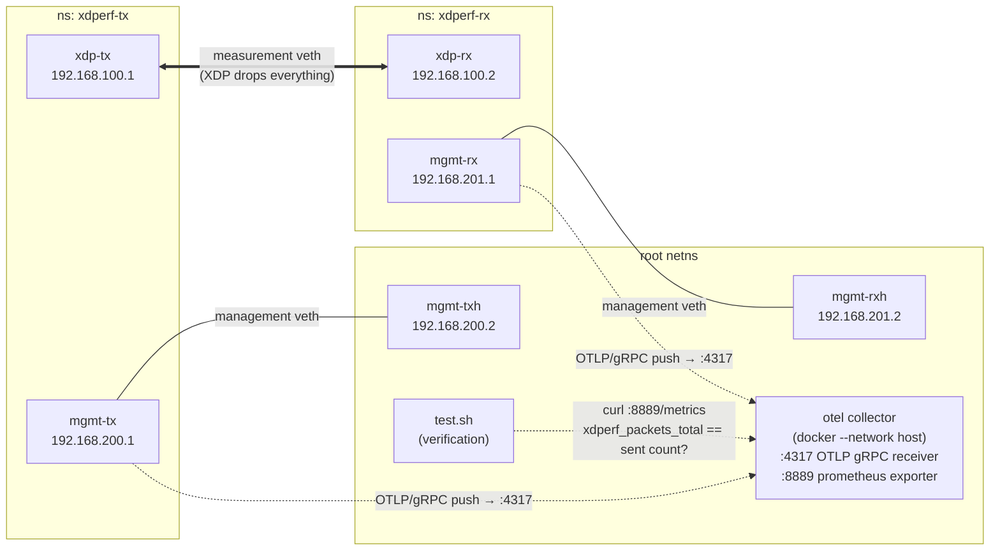

# otlp-metrics — OTLP metrics export to an OpenTelemetry Collector

End-to-end example for `--otlp-endpoint` (OTLP/gRPC metrics push): both the
sender and the receiver push their statistics to a Collector running in
docker, and the test verifies via the Collector's prometheus exporter that
`xdperf_packets_total{network_io_direction="transmit"}` matches the number
of packets sent exactly and the receive counter clears the threshold.

Requires **docker** in addition to the common prerequisites; SKIPs (exit 3)
when docker is unavailable. See [docs/ja/otlp_metrics.md](../../docs/ja/otlp_metrics.md)
for the metric reference and a Prometheus + Grafana pipeline.

## Topology

The receive-side XDP program drops every IPv4/IPv6 frame on the measurement
link, so the gRPC push cannot travel over it — each netns gets a separate
management veth into the root netns where the Collector listens:



Note that no Prometheus server is involved: `test.sh` scrapes the
Collector's prometheus **exporter** endpoint directly with `curl` and
compares the cumulative counters against the send count. For a real
Prometheus + Grafana pipeline, see
[docs/ja/otlp_metrics.md](../../docs/ja/otlp_metrics.md).

## Run

```bash
# At the repository root, beforehand:
make build

sudo ./setup.sh
sudo ./test.sh
sudo ./teardown.sh
```

## Experimenting by hand

After `setup.sh`, keep traffic flowing and watch the metrics instead of
running `test.sh`:

```bash
sudo ip netns exec xdperf-tx ../../out/bin/xdperf run --device xdp-tx \
    --plugin simpleudp.tinygo --plugin-path ../../out/bin \
    --duration 60s --pps 10k \
    --cfg '{"src_ip":"192.168.100.1","dst_ip":"192.168.100.2","dst_port":10001,"payload_size":256,"is_arp_resolve":false}' \
    --otlp-endpoint 192.168.200.2:4317 --otlp-insecure --otlp-interval 1s

# In another terminal: cumulative counters in prometheus format
curl -s localhost:8889/metrics | grep ^xdperf

# Or the raw pushes as seen by the collector
docker logs -f xdperf-otelcol
```

Note: on the measurement link a receive server must be attached first
(`veth` XDP TX needs the peer's NAPI active — see the
[examples README](../README.md#how-it-works)); `test.sh` handles that
ordering, when experimenting start one with
`sudo ip netns exec xdperf-rx ../../out/bin/xdperf run --device xdp-rx --send=false --recv`.

## Parameters (environment variables)

| Variable | Default | Description |
|----------|---------|-------------|
| `COUNT` | `10k` | Number of packets to send |
| `PPS` | `10k` | Send rate |
| `PASS_THRESHOLD` | `100` | Receive rate (%) required to PASS |
| `OTEL_IMAGE` | `otel/opentelemetry-collector:0.156.0` | Collector image |
| `OTEL_CONTAINER` | `xdperf-otelcol` | Container name |
| `OTLP_PORT` / `PROM_PORT` | `4317` / `8889` | Collector ports (host network) |
