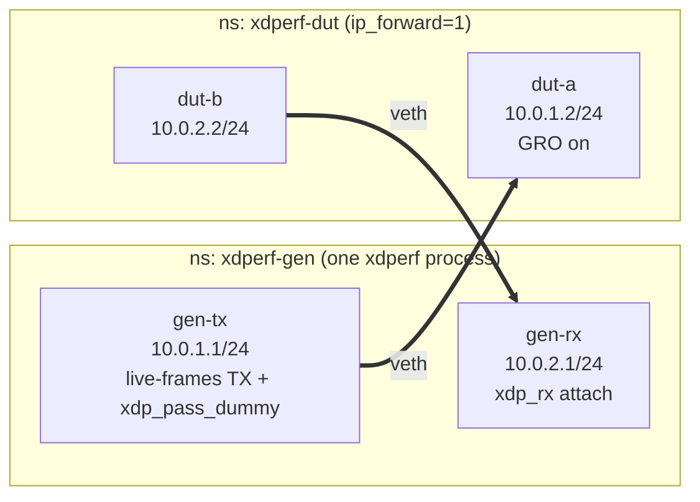

# simpleudp-split-rx — one process, TX and RX on different devices

Exercises the `--rx-device` flag: a single `xdperf run` process transmits on
one veth and counts with `xdp_rx` on another, while a middle "DUT" namespace
routes between the two subnets. This is the veth-scale model of a loop
topology — `xdperf --(eth1)--> DUT --(eth2)--> xdperf` — measured by one
process instead of a separate client and server.

`--rx-device` implies `--recv`, so the plain client invocation is enough:

```bash
xdperf run --device gen-tx --rx-device gen-rx --plugin simpleudp.tinygo ...
```

## Topology



- Packets are crafted with `dst_ip` = gen-rx's address and `dst_mac` = dut-a's
  MAC (the plugin default is broadcast, which Linux does not forward), so the
  DUT routes them out dut-b and they land on gen-rx where `xdp_rx` counts and
  drops them.
- In split mode the process attaches `xdp_rx` to the RX device and keeps
  `xdp_pass_dummy` on the TX device — the latter is still needed for the
  veth XDP_TX transmit path on gen-tx.
- dut-a has no XDP program, so `setup.sh` enables GRO on it to activate its
  NAPI; without that the veth XDP TX path silently drops every frame (see
  [simpleudp-no-rx-attach](../simpleudp-no-rx-attach/README.md) for the
  kernel background).

## Verification

`gen-rx`'s `rx_queue_*_xdp_packets` counters disappear when the process exits
(XDP detaches), so `test.sh` asserts two persistent signals instead:

1. the delta of dut-b's `tx_packets` (frames the DUT forwarded toward gen-rx)
   matches the send count within an ARP margin, and
2. the xdperf log contains nonzero `recv/s` lines — proof that `xdp_rx` on
   the RX device counted while the run was live.

## Run

```bash
sudo ./setup.sh
sudo ./test.sh
sudo ./teardown.sh
```

## Parameters (environment variables)

| Variable | Default | Description |
|----------|---------|-------------|
| `COUNT` | `30k` | Number of packets to send (~3s at the default rate, so several stats ticks land in the log) |
| `PPS` | `10k` | Send rate |
| `PAYLOAD_SIZE` | `256` | UDP payload size |
| `DST_PORT` | `10001` | Destination port |
| `PLUGIN` | `simpleudp.tinygo` | Plugin to use |
| `PASS_THRESHOLD` | `100` | Forwarded rate (%) required to PASS |
