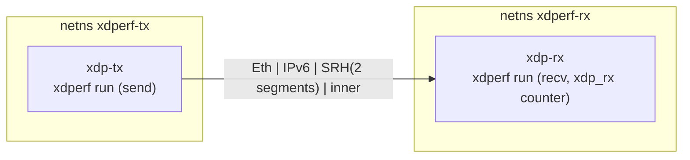

# srv6 — SRv6 encapsulated traffic over a veth pair

Sends SRv6 (RFC 8754) traffic with the [srv6.go plugin](../../plugins/srv6.go/)
in all three encapsulation modes and verifies the receive count with the
XDP-level counter on the peer.



Per mode, 10k frames (IMIX 256/768/1400, weights 7/2/1) with a flow-label
sweep and an inner source-port sweep:

| Mode | SRH next header | Inner packet |
|------|-----------------|--------------|
| `l3vpn_ipv4` | 4 | IPv4 + UDP |
| `l2vpn_eth` | 143 | Ethernet + IPv4 + UDP |
| `ipv6` | 41 | IPv6 + UDP |

The frames are fully built by the plugin with the peer's MAC as a static
`dst_mac` (`is_arp_resolve: false`), so the veths keep IPv6 disabled (as in
the simpleudp topology) and the counter comparison stays exact.

## Run

```sh
sudo ./examples/srv6/setup.sh
sudo ./examples/srv6/test.sh      # exit 0 = PASS, 3 = SKIP (no live-frames)
sudo ./examples/srv6/teardown.sh
```

Overridable environment variables: `COUNT` (10k), `PPS` (10k).
